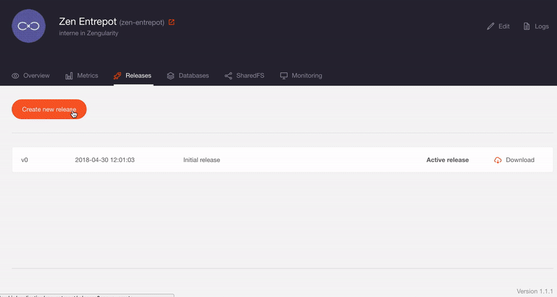

# Entrepot utility

Utility webapp for Zengularity Entrepot.

## Usage

*[See documentation](https://github.com/zengularity/entrepot/blob/master/README.md#badges-1)*

## Build

**Requirements:**

- [Go lang](https://golang.org/)

**Developpement:**

    go run src/server/*.go

**NIC:**

First prepare the distribution:

    ./nic-build.sh

Then deploy a pre-built release on NIC:

